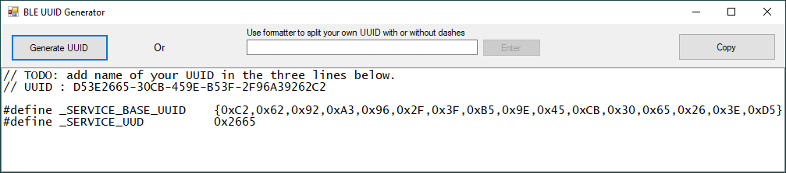

# Why this program was written

If you are developing a BLE application with Nordic Semi's SDK, there is a need to generate a UUID for your custom services and characteristics, for example, [NovelBits MIDI example](https://www.novelbits.io/bluetooth-gatt-services-characteristics/). Mohammad Afaneh gives the [rules for these UUIDs](https://www.novelbits.io/uuid-for-custom-services-and-characteristics/) and suggests using a [general purpose UUID generator](http://www.guidgenerator.com/) followed by a manual check for clashes with the BT SIG reserved range.

The Nordic SDK method of declaring these UUIDs requires them to be given as byte arrays in reverse order, with least significant byte first. Although this is not difficult to do manually, there is some possibility of error which would be difficult to detect without going through the full debug cycle of programming a device and reading back the UUIDs on a tool such as [LightBlue](https://punchthrough.com/introducing-lightblue-explorer-for-android/) or [nRF Connect](https://www.nordicsemi.com/Software-and-tools/Development-Tools/nRF-Connect-for-mobile). I have automated the whole process in a simple Windows Form app - BLE UUID Generator

# BLE UUID Generator

The program generates a UUID immediately when opened, using the built-in Windows GUID functionality. This is checked for collision with the BT SIG reserved range XXXXXXXX-0000-1000-8000-00805F9B34FB and then displayed in the text box as a snippet of C code - as a comment and as a reversed order byte array as required by the Nordic SDK. It also extracts the second 16 bits as required.

Use the Copy button to copy the contents of the text box to the clipboard for pasting into your code. You should then add the name of your service as a comment and as prefixes to the #defines and then remove the TODO.

If you need another UUID, press the Generate UUID button.

If you already have a UUID that you would like to format in this way (and check for collision with the reserved range), paste it into the small text box in the top middle and press return or the Enter button. If your UUID is in the BT SIGgith reserved range, a warning message box will be shown; the formatter still runs but it is up to you to heed the warning.

No guarantees of uniqueness can be made, this program is simply calling Microsoft's Guid.NewGuid() function [as documented.](https://docs.microsoft.com/en-us/dotnet/api/system.guid.newguid?view=netcore-3.1)

The executable is a single file which runs on Windows 10 assuming the .NET Framework 4.7.2 is installed, so it does not need an installer. Source code is on GitHub.